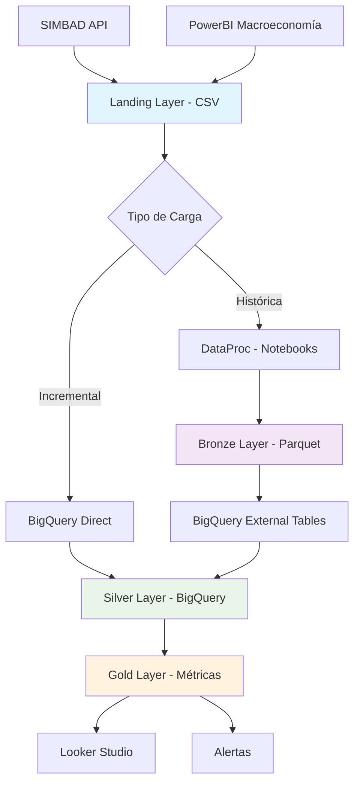

# Arquitectura DMC - Pipeline de Datos Integral

## 🏗️ **Visión General**

Pipeline de datos completo para análisis de créditos hipotecarios SIMBAD e indicadores macroeconómicos usando arquitectura lakehouse híbrida en Google Cloud Platform.

## 📊 **Arquitectura por Capas**



## 🔄 **Servicios GCP por Capa**

### **🌊 Landing Layer**
| Servicio | Uso | Configuración |
|----------|-----|---------------|
| **Cloud Storage** | Almacenamiento CSV raw | `gs://dae-integrador-2025/lakehouse/landing/` |
| **Cloud Run** | SIMBAD API harvester | Trigger automático por HTTP |
| **Cloud Scheduler** | Automatización de cargas | Diario 5:00 AM |
| **Cloud Build** | CI/CD para deployers | Trigger en push a main |

**Estructura de Datos:**
```
landing/
├── simbad/simbad_carteras_aayp_hipotecarios/dt=2024-09-14/*.csv
└── macroeconomics/
    ├── desempleo_imf/dt=2024-09-14/*.csv
    ├── inflacion_12m/dt=2024-09-14/*.csv
    └── tipo_cambio/dt=2024-09-14/*.csv
```

### **🔧 Bronze Layer**
| Servicio | Uso | Configuración |
|----------|-----|---------------|
| **DataProc** | Notebooks Jupyter para carga histórica | cluster-integrador-2025 |
| **Cloud Storage** | Parquet optimizado | `gs://dae-integrador-2025/lakehouse/bronze/` |
| **BigQuery** | External tables sobre Parquet | Auto-detección con wildcards |

**Responsabilidades:**
- ✅ **DataProc**: Carga histórica completa (2012-presente)
- ✅ **PySpark**: Conversión CSV → Parquet con esquemas estables
- ✅ **Particionado**: SIMBAD por anio/mes, Macro por dt_captura

**Notebooks DataProc:**
```
lakehouse_processing/notebooks/
├── bronze_simbad_ingestion.ipynb          # 676K registros históricos
├── bronze_macroeconomics_ingestion.ipynb  # Datos macro por dataset
├── silver_data_cleaning.ipynb             # Placeholder
└── gold_metrics_aggregation.ipynb         # Placeholder
```

### **🧼 Silver Layer**
| Servicio | Uso | Configuración |
|----------|-----|---------------|
| **BigQuery** | Procesamiento y almacenamiento | Tablas clustered |
| **BigQuery Stored Procedures** | Lógica de transformación | Prefijo `sp_` |
| **Cloud Scheduler** | Trigger automático | Diario 6:00 AM |

**Transformaciones:**
- 🔄 **Incremental**: Solo nuevos dt_captura desde landing CSV
- 🧹 **Limpieza**: Deduplicación, normalización, validación
- 📊 **Enriquecimiento**: Flags de calidad, campos derivados
- 🏗️ **Clustering**: Por entidad y tipoCliente

**Stored Procedures Silver:**
```sql
-- Incremental optimizado (recomendado)
CALL sp_process_landing_to_silver_incremental();

-- Desde bronze parquet (fallback)
CALL sp_process_bronze_to_silver();
```

### **🏆 Gold Layer**
| Servicio | Uso | Configuración |
|----------|-----|---------------|
| **BigQuery** | Métricas agregadas | Particionado temporal |
| **BigQuery Stored Procedures** | KPIs y agregaciones | Automatizado |
| **Cloud Scheduler** | Refresh métricas | Diario 7:00 AM |

**Métricas de Negocio:**
- 📈 **KPIs Financieros**: Tasa mora, cobertura garantía, provisiones
- 🌍 **Agregaciones**: Por provincia, entidad, período
- 📊 **Macroeconomía**: Inflación, tipo cambio integrado
- ⚠️ **Alertas**: Detección automática de riesgos

**Tablas Gold:**
```sql
-- Métricas principales
gold.simbad_gold                    -- Agregado por provincia/período
gold.alertas_provincia_12m          -- Sistema de alertas
gold.alertas_provincia_12m_looker   -- Vista optimizada para Looker
```

### **📊 Presentation Layer**
| Servicio | Uso | Configuración |
|----------|-----|---------------|
| **Looker Studio** | Dashboards ejecutivos | Conectado a BigQuery |
| **BigQuery** | API para consultas | Acceso directo |
| **Cloud Functions** | Alertas automáticas | Trigger por cambios |

## 🚀 **CI/CD Pipeline**

### **Cloud Build Triggers**
| Trigger | Fuente | Acción |
|---------|--------|--------|
| **main-deploy** | Push a `main` | Deploy completo |
| **desarrollo-test** | Push a `desarrollo` | Testing |
| **simbad-harvester** | Cambios en `landing/` | Deploy harvester |

### **Automatización**
```yaml
# .github/workflows or cloudbuild.yaml
steps:
  - name: 'Deploy Landing Services'
    env: ['PROJECT=proyecto-integrador-dae-2025']
  - name: 'Update BigQuery Procedures'
    env: ['DATASET=silver_clean']
  - name: 'Test Pipeline End-to-End'
    env: ['RUN_VALIDATION=true']
```

## ⏰ **Scheduling y Triggers**

### **Cloud Scheduler Jobs**
| Job | Horario | Servicio Target | Función |
|-----|---------|-----------------|---------|
| `simbad-daily-harvest` | 5:00 AM | Cloud Run | Extraer datos SIMBAD |
| `macro-daily-harvest` | 5:30 AM | Cloud Run | Extraer datos macro |
| `silver-incremental` | 6:00 AM | BigQuery | Procesar nuevos datos |
| `gold-metrics-refresh` | 7:00 AM | BigQuery | Actualizar métricas |
| `alertas-daily-check` | 8:00 AM | Cloud Function | Enviar alertas |

### **Event-Driven Triggers**
- **Cloud Storage**: Trigger automático al llegar nuevos CSV
- **BigQuery**: Trigger en completación de silver para gold
- **Pub/Sub**: Notificaciones entre servicios

## 💾 **Almacenamiento y Optimización**

### **Cloud Storage**
```
Bucket: dae-integrador-2025
├── /lakehouse/landing/     # CSV raw (30 días retention)
├── /lakehouse/bronze/      # Parquet optimizado (1 año)
└── /logs/                  # Logs de procesamiento
```

### **BigQuery**
```
Proyecto: proyecto-integrador-dae-2025
├── bronze/                 # External tables
├── silver_clean/          # Tablas clustered
├── gold/                  # Métricas particionadas
└── logs/                  # Process logs
```

**Optimizaciones:**
- ✅ **Particionado temporal** en gold por período
- ✅ **Clustering** en silver por entidad
- ✅ **External tables** para reducir costos de storage
- ✅ **Incremental loading** para eficiencia

## 🔐 **Seguridad y Governance**

### **IAM Roles**
- **DataProc**: `roles/dataproc.worker`
- **BigQuery**: `roles/bigquery.dataEditor`
- **Cloud Storage**: `roles/storage.objectAdmin`
- **Cloud Scheduler**: `roles/cloudscheduler.admin`

### **Data Lineage**
```
SIMBAD API → Landing CSV → {Bronze Parquet | Direct Silver} → Gold Metrics → Looker
PowerBI → Landing CSV → Bronze Parquet → Gold Metrics → Alertas
```

## 📈 **Monitoreo y Alertas**

### **Métricas Clave**
- **Latencia**: Tiempo landing → gold < 2 horas
- **Volumen**: 676K+ registros SIMBAD procesados
- **Calidad**: < 1% registros con flags de error
- **Disponibilidad**: 99.9% uptime del pipeline

### **Logging Centralizado**
```sql
-- Verificar estado del pipeline
SELECT process_name, status, rows_processed, message
FROM gold.process_log
WHERE created_at >= CURRENT_DATE()
ORDER BY created_at DESC
```

## 🎯 **Roadmap Técnico**

### **Optimizaciones Actuales**
- ✅ Arquitectura híbrida DataProc + BigQuery
- ✅ Carga incremental automatizada
- ✅ Stored procedures con manejo de errores
- ✅ External tables para reducir costos

### **Próximas Mejoras**
- 🔄 **Real-time streaming** con Pub/Sub + Dataflow
- 🤖 **ML Pipeline** para predicción de mora
- 📊 **Data Quality** automatizado con Great Expectations
- 🌐 **Multi-region** para alta disponibilidad

---

## 🛠️ **Quick Start**

### **Deploy Pipeline Completo**
```bash
# 1. Deploy servicios de landing
gcloud builds submit --config=landing/cloudbuild.yaml

# 2. Crear external tables en BigQuery
bq query < bigquery_processing/schemas/bronze_external_tables.sql

# 3. Deploy stored procedures
bq query < bigquery_processing/stored_procedures/sp_*.sql

# 4. Configurar scheduling
gcloud scheduler jobs create http simbad-daily --schedule="0 5 * * *"
```

### **Ejecutar Pipeline Manual**
```sql
-- Pipeline completo incremental
CALL `proyecto-integrador-dae-2025.gold.sp_full_pipeline_refresh`();

-- Solo silver incremental
CALL `proyecto-integrador-dae-2025.bronze.sp_process_landing_to_silver_incremental`();
```