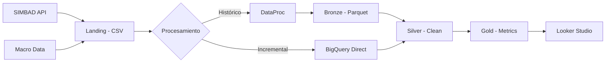

# DMC - Pipeline de Datos Integral

**Sistema completo de análisis de créditos hipotecarios SIMBAD e indicadores macroeconómicos usando arquitectura lakehouse híbrida en Google Cloud Platform.**

[](https://cloud.google.com)
[](https://cloud.google.com/bigquery)
[](https://cloud.google.com/dataproc)
[](https://python.org)

## 🎯 **Visión General**

Pipeline de datos end-to-end que:
- 📊 **Extrae** datos de SIMBAD (Superintendencia de Bancos RD) y fuentes macroeconómicas
- 🔄 **Procesa** usando arquitectura lakehouse (Landing → Bronze → Silver → Gold)
- 📈 **Genera** métricas de riesgo crediticio y KPIs financieros
- ⚡ **Automatiza** con scheduling y triggers inteligentes
- 📱 **Visualiza** en dashboards ejecutivos

## 🏗️ **Arquitectura**



**Ver documentación completa**: [ARCHITECTURE.md](./ARCHITECTURE.md)

## 📁 **Estructura del Proyecto**

```
├── 📊 bigquery_processing/           # Pipeline SQL BigQuery
│   ├── stored_procedures/           # SP con prefijo sp_
│   ├── bronze_to_silver/           # Transformaciones
│   ├── silver_to_gold/             # Métricas y KPIs
│   ├── schemas/                    # DDL tablas
│   └── documentation/              # Estrategias técnicas
│
├── 🔧 lakehouse_processing/         # Pipeline DataProc
│   ├── notebooks/                  # Jupyter notebooks
│   └── README.md                   # Docs DataProc
│
├── 🌐 landing/                     # Extractores de datos
│   ├── simbad/                     # SIMBAD API harvester
│   └── macroeconomics/             # Datos macro scraper
│
├── 🚀 web_app/                     # Interfaz web (opcional)
│   ├── frontend/                   # React + TypeScript
│   └── backend/                    # FastAPI + Python
│
├── 📄 ARCHITECTURE.md              # Documentación arquitectural
└── 📋 README.md                    # Este archivo
```

## 🚀 **Quick Start**

### **1. Prerrequisitos**
```bash
# Configurar GCP
gcloud config set project proyecto-integrador-dae-2025
gcloud auth application-default login

# Habilitar servicios
gcloud services enable bigquery.googleapis.com \
    dataproc.googleapis.com \
    cloudbuild.googleapis.com \
    cloudscheduler.googleapis.com \
    storage.googleapis.com
```

### **2. Deploy Pipeline**
```bash
# 1. Crear external tables
bq query < bigquery_processing/schemas/bronze_external_tables.sql

# 2. Deploy stored procedures
bq query < bigquery_processing/stored_procedures/sp_*.sql

# 3. Configurar scheduling
gcloud scheduler jobs create http simbad-daily \
  --schedule="0 5 * * *" \
  --uri="https://us-central1-proyecto-integrador-dae-2025.cloudfunctions.net/trigger-simbad"
```

### **3. Ejecutar Pipeline**
```sql
-- Pipeline completo
CALL `proyecto-integrador-dae-2025.gold.sp_full_pipeline_refresh`();

-- Solo incremental
CALL `proyecto-integrador-dae-2025.bronze.sp_process_landing_to_silver_incremental`();
```

## 📊 **Datos y Métricas**

### **Fuentes de Datos**
| Dataset | Volumen | Frecuencia | Período |
|---------|---------|------------|---------|
| **SIMBAD Hipotecarios** | 676K+ registros | Mensual | 2012-presente |
| **Inflación RD** | Datos diarios | Diario | 2020-presente |
| **Tipo de Cambio** | Compra/Venta | Diario | 2020-presente |
| **Desempleo IMF** | Por país | Mensual | 2020-presente |

### **KPIs Principales**
- 📈 **Tasa de Morosidad**: Por entidad/provincia/período
- 💰 **Cobertura de Garantías**: Valorización vs deuda
- 🏛️ **Concentración por Entidad**: Distribución de cartera
- 🌍 **Análisis Geográfico**: Métricas por provincia
- 📊 **Correlación Macro**: Impacto de inflación/TC en mora

## ⏰ **Automatización**

### **Schedule Diario**
```
05:00 AM → Extraer datos SIMBAD + Macro
06:00 AM → Procesamiento incremental Silver
07:00 AM → Actualizar métricas Gold
08:00 AM → Generar alertas automáticas
```

### **Triggers Automáticos**
- ✅ **Nuevos archivos** en Landing → Trigger procesamiento
- ✅ **Datos Silver listos** → Trigger métricas Gold
- ✅ **Alertas detectadas** → Notificaciones automáticas

## 🔧 **Tecnologías**

### **Core Stack**
- **☁️ Google Cloud Platform**: Infraestructura principal
- **📊 BigQuery**: Data warehouse y processing engine
- **⚡ DataProc**: Cluster PySpark para carga histórica
- **🗄️ Cloud Storage**: Data lake storage
- **⏰ Cloud Scheduler**: Automatización temporal

### **Processing**
- **🐍 Python**: Extractores y transformaciones
- **🔥 PySpark**: Procesamiento distribuido
- **📝 SQL**: Transformaciones y métricas BigQuery
- **🔗 Stored Procedures**: Lógica de negocio automatizada

### **CI/CD**
- **🏗️ Cloud Build**: Continuous deployment
- **📦 GitHub**: Control de versiones
- **🐳 Docker**: Containerización
- **📋 YAML**: Configuración como código

## 📈 **Monitoreo**

### **Health Checks**
```sql
-- Estado del pipeline
SELECT process_name, status, rows_processed, message
FROM `proyecto-integrador-dae-2025.gold.process_log`
WHERE created_at >= CURRENT_DATE()
ORDER BY created_at DESC;
```

### **Métricas Clave**
- **⏱️ Latencia**: Landing → Gold < 2 horas
- **📊 Volumen**: 676K+ registros procesados
- **✅ Calidad**: < 1% registros con errores
- **🔄 Disponibilidad**: 99.9% uptime

## 🔍 **Estado Actual**

### ✅ **Componentes Funcionales**
- ✅ **Landing extractors**: SIMBAD + Macroeconomía
- ✅ **DataProc notebooks**: Carga histórica Bronze
- ✅ **BigQuery external tables**: Bronze layer activo
- ✅ **Silver tables**: Datos limpios disponibles
- ✅ **Gold metrics**: KPIs agregados funcionando
- ✅ **Stored procedures**: Automatización lista
- ✅ **Architecture docs**: Documentación completa

### 🔄 **En Deploy**
- 🔄 **External table CSV**: Landing → Silver direct
- 🔄 **Cloud Scheduler**: Jobs automatizados
- 🔄 **Incremental loading**: Optimización final
- 🔄 **Alerting system**: Notificaciones automáticas

## 🤝 **Contribución**

### **Para Desarrolladores**
1. **Clone**: `git clone https://github.com/noctics123/dmc_proyecto_integrador.git`
2. **Setup**: Seguir [Quick Start](#-quick-start)
3. **Develop**: Trabajar en rama `desarrollo`
4. **PR**: Merge a `main` para deploy automático

### **Para Analistas**
- **Dashboards**: Acceso directo a Looker Studio
- **Queries**: BigQuery público para consultas ad-hoc
- **Alertas**: Configuración de notificaciones personalizadas

## 📚 **Documentación**

- 🏗️ **[ARCHITECTURE.md](./ARCHITECTURE.md)**: Arquitectura técnica completa
- 📊 **[bigquery_processing/README.md](./bigquery_processing/README.md)**: Pipeline SQL BigQuery
- 🔧 **[lakehouse_processing/README.md](./lakehouse_processing/README.md)**: Pipeline DataProc
- 📈 **[Incremental Strategy](./bigquery_processing/documentation/incremental_loading_strategy.md)**: Estrategia de carga optimizada

## 📞 **Soporte**

- **Issues**: [GitHub Issues](https://github.com/noctics123/dmc_proyecto_integrador/issues)
- **Documentation**: Ver archivos markdown en cada directorio
- **Monitoring**: Logs centralizados en Cloud Logging

---

**🎯 Pipeline robusto, escalable y automatizado para análisis integral de riesgo crediticio en República Dominicana.**