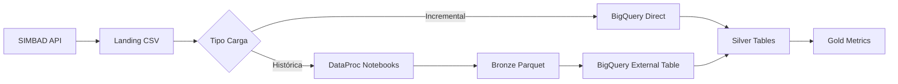

# Estrategia de Carga Incremental Optimizada

## 🎯 **Estrategia Recomendada: Híbrida**

### **Carga Histórica (Una vez)**
- **DataProc Notebooks**: Para carga inicial completa (2012-presente)
- **Formato**: CSV → Parquet (optimizado para consultas históricas)
- **Uso**: Solo cuando se requiere reprocesar todo el histórico

### **Carga Incremental (Diaria/Automática)**
- **BigQuery Direct**: Lee CSV landing directo a Silver
- **Ventaja**: Sin dependencia de DataProc cluster activo
- **Eficiencia**: Solo procesa nuevos dt= automáticamente

## 📋 **Comparación de Enfoques**

| Aspecto | DataProc Incremental | BigQuery Direct CSV | Híbrida (Recomendada) |
|---------|---------------------|-------------------|----------------------|
| **Costo** | Alto (cluster activo) | Bajo (solo query) | Óptimo |
| **Latencia** | Media (espera cluster) | Baja (inmediata) | Baja |
| **Complejidad** | Alta (PySpark + BQ) | Media (SQL puro) | Media |
| **Dependencias** | DataProc + BigQuery | Solo BigQuery | Mínimas |
| **Escalabilidad** | Buena | Excelente | Excelente |

## 🏗️ **Arquitectura Optimizada**



## 🔄 **Flujos de Procesamiento**

### **Flujo Histórico (Inicial)**
1. **Landing**: CSV histórico completo en GCS
2. **DataProc**: Notebooks procesan CSV → Parquet Bronze
3. **BigQuery**: External tables leen Parquet Bronze
4. **Silver**: Transformación Bronze → Silver
5. **Gold**: Agregaciones Silver → Gold

### **Flujo Incremental (Diario)**
1. **Landing**: Nuevo CSV con dt=YYYY-MM-DD
2. **BigQuery**: SP detecta nuevo dt= automáticamente
3. **Silver**: Procesa CSV landing directo a Silver
4. **Gold**: Actualiza solo métricas afectadas

## 📝 **Stored Procedures Creados**

### **Para Carga Incremental Optimizada:**

1. **`sp_process_landing_to_silver_incremental`**
   - Detecta nuevos dt= en landing CSV
   - Procesa solo archivos nuevos
   - Limpieza y validación robusta
   - Deduplicación automática

2. **`sp_process_silver_to_gold`**
   - Actualiza métricas incrementalmente
   - Solo procesa períodos afectados
   - Enriquece con datos macroeconómicos

3. **`sp_full_pipeline_refresh`**
   - Orquestador principal
   - Manejo de errores centralizado
   - Logging completo

## ⚡ **Optimizaciones Clave**

### **External Table CSV Inteligente**
```sql
CREATE EXTERNAL TABLE simbad_landing_csv_ext
OPTIONS (
  format = 'CSV',
  uris = ['gs://bucket/landing/simbad/*/dt=*/*.csv']
)
```
- **Wildcards**: Detecta nuevos archivos automáticamente
- **Path parsing**: Extrae dt_captura del _FILE_NAME
- **Flexible**: Maneja múltiples formatos de fecha

### **Detección Incremental Automática**
```sql
-- Solo procesar archivos más nuevos que último dt_captura en Silver
WHERE REGEXP_EXTRACT(_FILE_NAME, r'/dt=(\d{4}-\d{2}-\d{2})/') >
  (SELECT MAX(dt_captura) FROM silver_clean.simbad_hipotecarios)
```

### **Parsing Robusto de Datos**
```sql
-- Limpieza numérica tolerante a caracteres especiales
SAFE_CAST(REGEXP_REPLACE(REGEXP_REPLACE(deudaCapital, r'[,$]', ''), r'[^0-9.-]', '') AS FLOAT64)

-- Parsing de fechas con múltiples formatos
COALESCE(
  SAFE.PARSE_DATE('%Y-%m', periodo),
  SAFE.PARSE_DATE('%Y/%m', periodo),
  SAFE.PARSE_DATE('%m/%Y', periodo)
)
```

## 📊 **Monitoreo y Alertas**

### **Métricas de Control**
- **Filas procesadas** por dt_captura
- **Tiempo de ejecución** por stored procedure
- **Calidad de datos** (flags de error)
- **Cobertura temporal** (gaps en fechas)

### **Logs Centralizados**
```sql
SELECT process_name, status, rows_processed, message
FROM gold.process_log
WHERE created_at >= CURRENT_DATE()
ORDER BY created_at DESC
```

## 🚀 **Scheduling Recomendado**

### **Cloud Scheduler Jobs**
1. **Incremental SIMBAD**: Diario 6:00 AM
   ```bash
   gcloud scheduler jobs create http simbad-incremental \
     --schedule="0 6 * * *" \
     --uri="https://us-central1-proyecto-integrador-dae-2025.cloudfunctions.net/trigger-bq-incremental"
   ```

2. **Gold Metrics Update**: Diario 7:00 AM
   ```bash
   gcloud scheduler jobs create http gold-metrics-update \
     --schedule="0 7 * * *" \
     --uri="https://us-central1-proyecto-integrador-dae-2025.cloudfunctions.net/trigger-gold-update"
   ```

## 🎯 **Beneficios de la Estrategia Híbrida**

### **Costos Optimizados**
- ✅ DataProc: Solo para carga histórica (ocasional)
- ✅ BigQuery: Processing incremental eficiente
- ✅ Storage: CSV + Parquet según necesidad

### **Performance Mejorado**
- ✅ Latencia baja para datos nuevos
- ✅ Sin overhead de cluster DataProc
- ✅ Queries BigQuery optimizadas

### **Mantenimiento Simplificado**
- ✅ Menos dependencias de infraestructura
- ✅ SQL puro para lógica incremental
- ✅ Logging y monitoreo centralizado

### **Escalabilidad**
- ✅ BigQuery escala automáticamente
- ✅ External tables detectan nuevos archivos
- ✅ Processing paralelo natural

## 📋 **Próximos Pasos**

1. **Crear external table** para CSV landing
2. **Deploy stored procedures** en BigQuery
3. **Configurar Cloud Scheduler** para automatización
4. **Implementar monitoring** con alertas
5. **Deprecar notebooks** de DataProc para incremental